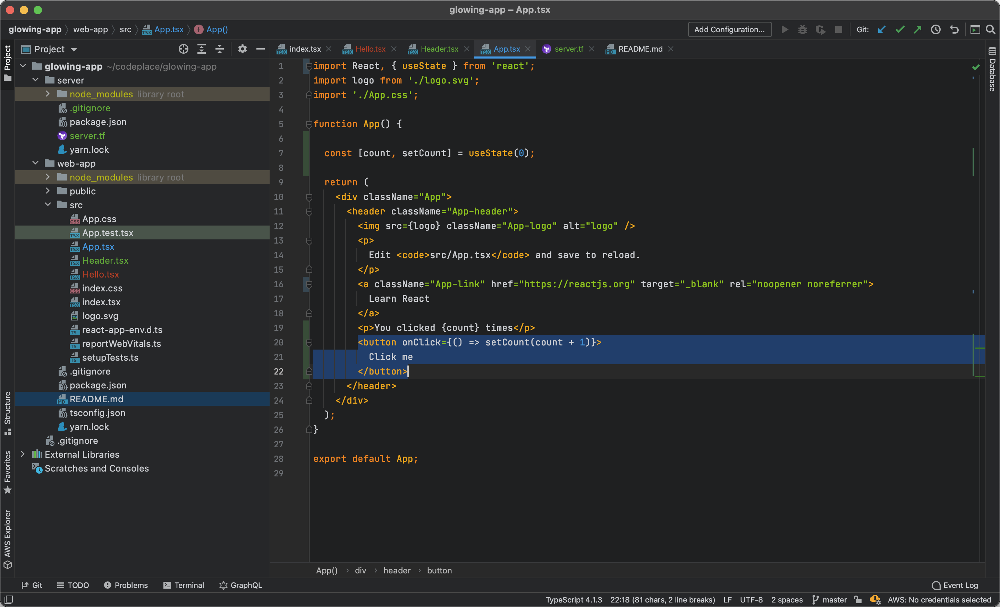

# Glowing Darcula Theme for JetBrains IDEs

[Download here!](https://plugins.jetbrains.com/plugin/15905-glowing-darcula)

Glowing Darcula is a high contrast theme, based on the iconic Darcula theme from JetBrains.

Carefully selected bright colors are working great with darkened backgrounds. Glowing Darcula Theme is excellent for
sunny days when you work outside or close to the window. The theme provides a smaller contrast between the dark mode
editor and other light windows, outside the IDE. Thoroughly implemented with attention to details provides a stable
addition to your favourite IDE. In addition to improving almost every single colour, Glowing Darcula brings beautiful
blue accents to your Editor Tabs, Progress Bar and Buttons.

## Colors

### Basic colors

| Name          | Darcula   | Glowing Darcula |
|---------------|:---------:|:---------------:|
| Purple        |  `#9876AA` |  `#B45DD9` |
| Orange        |  `#CC7832` |  `#F18622` |
| Yellow        |  `#FFC66D` |  `#F0A91D` |
| Blue          |  `#6897BB` |  `#4397E0` |
| Green         |  `#6A8759` |  `#91C71E` |
| Docs Green    |  `#629755` |  `#64AD39` |

### Greyscale colors

| Name          | Darcula   | Glowing Darcula |
|---------------|:---------:|:---------------:|
| White         |  `#A9B7C6` |  `#D0D2D6` |
| Comment       |  `#808080` |  `#8C8C8C` |
| Editor BG     |  `#2B2B2B` |  `#1F2021` |

### Python related

| Name          | Darcula   | Glowing Darcula |
|---------------|:---------:|:---------------:|
| Decorator     |  `#BBB529` |  `#DAD433` |
| Keyword arg.  |  `#AA4926` |  `#B83E25` |
| Built in name |  `#8888C6` |  `#8078FF` |
| Special names |  `#B200B2` |  `#B50EB5` |

### Other

| Name              | Darcula   | Glowing Darcula |
|-------------------|:---------:|:---------------:|
| Todo              |  `#A8C023` |  `#ABC72A` |
| Ignored           |  `#848504` |  `#B5B516` |
| Kotlin Type param |  `#20999D` |  `#219FA3` |
| Java Type param   |  `#507874` |  `#219FA3` |
| TS Type param     |  `#507874` |  `#219FA3` |
| HCL Blue          |  `#769AA5` |  `#219FA3` |

### FileColor

| Name          | Darcula   | Glowing Darcula |
|---------------|:---------:|:---------------:|
| Yellow        |  `#4F4B41` |  `#3D382E` |
| Green         |  `#49544A` |  `#313D32` |
| Blue          |  `#4F556B` |  `#31374A` |
| Violet        |  `#534A57` |  `#403645` |
| Orange        |  `#806052` |  `#45332B` |
| Rose          |  `#6E535B` |  `#452F35` |

### User-Defined File Types

| Name          | Darcula   | Glowing Darcula |
|---------------|:---------:|:---------------:|
| aKeyword1     |  `#CC7832` |  `#F18622` |
| aKeyword2     |  `#AB51BA` |  `#B45DD9` |
| aKeyword3     |  `#0F9795` |  `#0F9795` |
| aKeyword4     |  `#93A629` |  `#8078FF` |
| String        |  `#6A8759` |  `#91C71E` |
| Number        |  `#6897BB` |  `#4397E0` |

## Legal bit

Copyright (c) 2021 Bartosz Adamczyk

This [repository](https://github.com/bartoszadamczyk/glowing-darcula) and the
[plugin](https://plugins.jetbrains.com/plugin/15905-glowing-darcula)
is licensed under the [MIT License](LICENSE).

### HighContrast Theme files

This repository contains a copy of the HighContrast Theme files together with the `LICENSE.txt` file in
[high-contrast-theme-jetbrains](high-contrast-theme-jetbrains) directory provided by JetBrains in
[JetBrains/intellij-community repository](https://github.com/JetBrains/intellij-community/tree/master/platform/platform-resources/src/themes)
originally licensed under the
[Apache License 2.0](https://github.com/JetBrains/intellij-community/blob/master/LICENSE.txt).

HighContrast Theme files are used for reference, and they are not a part of the Glowing Darcula Theme Plugin.
